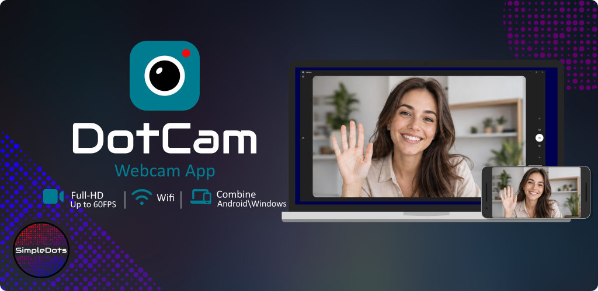
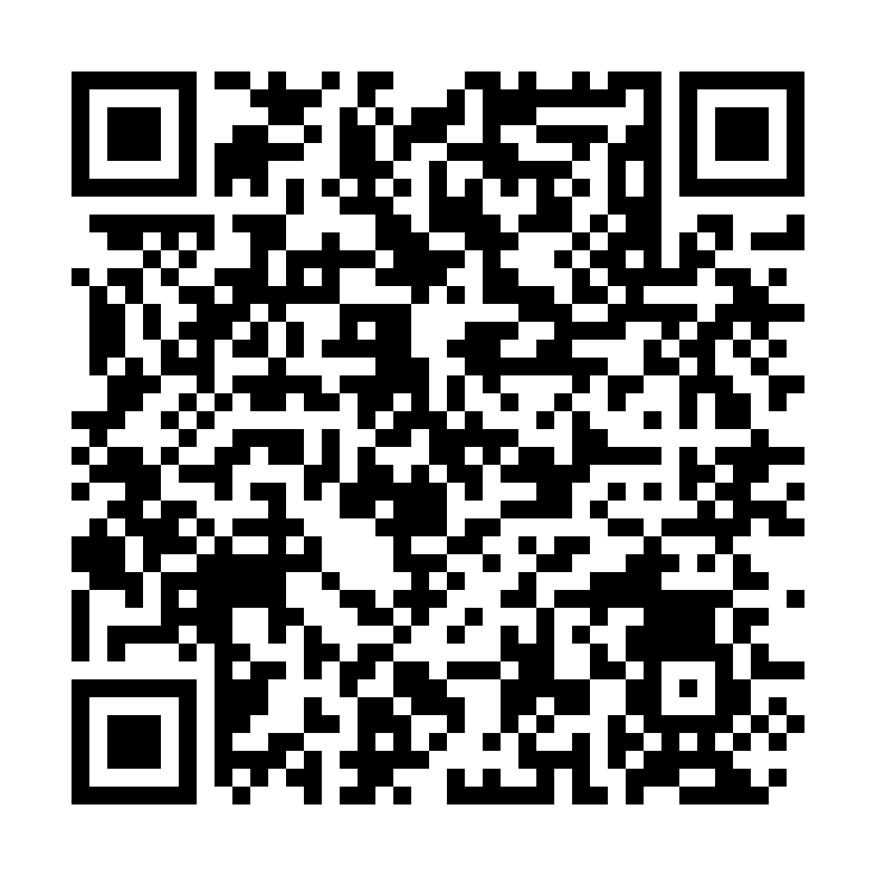
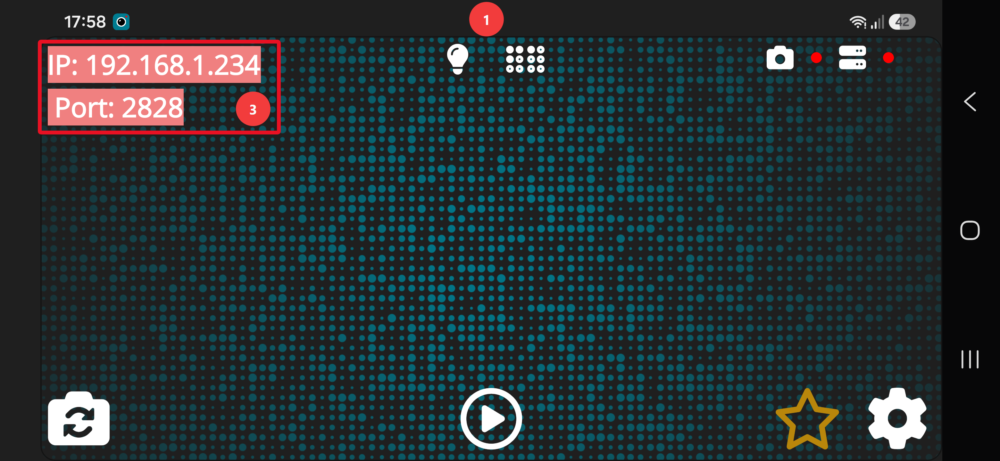
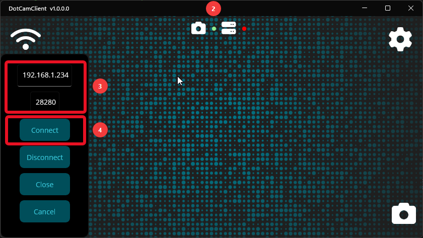

# DotCam Setup Guide

Turn your Android device into a webcam for your Windows PC with **DotCam** and **DotCamClient**.

---

## Table of Contents

- [Overview](#overview)
- [Prerequisites](#prerequisites)
- [Quick Setup](#quick-setup)
- [Quick Help](#quick-help)
- [Detailed Help](#detailed-help)

---

## Overview

This guide helps you prepare your devices, install the required apps, and create a stable connection between your Android device and your Windows PC.

DotCam allows you to stream your Android camera to your PC and use it as a webcam in supported Windows applications.

---

## Prerequisites

Before setting up DotCam, ensure the following requirements are met.

### 1. Required Downloads
| Application | Download | Alt |
|-------------|----------|---------|
| **DotCam** Android App | [Google Play](https://play.google.com/store/apps/details?id=com.simpledots.dotcam) |  |
| **DotCamClient** Windows App | [simple-dots.de](https://simple-dots.de/apps/dotcam) | |

### 2. Network Requirements
- Your Android device and Windows PC must be connected to the same local network
- For the best experience, use a modern router with a stable signal and sufficient bandwidth

### 3. Display Recommendation
- DotCam supports up to **60 FPS**
- For smooth 60 FPS playback, a **60 Hz or higher display** is recommended
- If you use **30 FPS**, this is less important and considered optional

### 4. Windows Requirements
- Additional **Visual C++ Redistributable** installation is required
- **DotCamClient** supports **Windows 10 and Windows 11**
- If you are interested in Linux support, please let me know

---

## Quick Preview

###  Android App  
 

### Windows Client
 

---

## Quick Setup

### Step 1: Open DotCam on Android
Launch the **DotCam** app on your Android device and keep it running.

Make sure the app displays:
- the current **IP address**
- the current **port**

### Step 2: Open DotCamClient on Windows
Launch **DotCamClient** on your Windows PC.

### Step 3: Enter the Connection Details
In **DotCamClient**, enter the **IP address** and **port** shown in the Android app.

### Step 4: Connect
Click **Connect** to establish the connection between your Android device and your PC.

### Step 5: Use DotCam as a Webcam
Select **DotCam source** as the webcam source in your preferred application.

---

## Quick Help

### Devices do not connect
- Make sure both apps are running
- Make sure your Android device and Windows PC are connected to the same local network
- Verify that the IP address and port were entered correctly
- Restart both apps and try again

### Connection fails after interruption
- If the connection was lost and cannot be restored, restart both apps
- Reconnect after both apps have been restarted
- Verify that the network connection is still stable
- Make sure the Android app is still active

### Pro status is inactive
- Make sure you are signed in with a Google account on your Android device
- In some cases, an active internet connection is required to verify the purchase status
- Wait a moment and try again if the status does not update immediately

### Stream is lagging or not smooth
- Try lowering the resolution
- Try lowering the frame rate
- Try lowering the bitrate
- Use a modern router and a fast Wi-Fi connection for the best experience
- Keep in mind that the Android device may not provide enough performance for higher settings
- If needed, try using a USB OTG network adapter for a more stable connection

### The app crashes
- In rare cases, local app data may become corrupted
- For **DotCamClient**, try deleting the `settings.json` file and then start the app again
- If the Android app still crashes after a restart, reinstall the app

### DotCamClient settings file location
- Windows path:
- `C:\Users\YourName\AppData\Local\User Name\com.simpledots.dotcamclient\Data`

### No camera output
- If a connection is currently active, disconnect it first
- Close all applications that are currently using the camera
- If needed, use Task Manager to make sure no background process is still accessing the camera
- After that, adjust the camera settings or restart the camera from within **DotCamClient**

### Firewall or network restrictions
- A local firewall or security software may block the connection between your Android device and your PC
- Allow **DotCamClient** through the Windows Firewall
- Verify that local network communication is not restricted by your router or other security settings

### No camera output (advanced)
- **DotCamClient** supports different methods to provide the camera feed on Windows
- After Windows updates, it may be necessary to re-register the camera component
- This mainly affects the **DirectShow filter mode**

---

## Detailed Help
- [Detailed Android App Guide](/docs/DotCam.md)

- [Detailed Windows App Guide](/docs/DotCamClient.md)

- [Compability](/docs/Compability.md)

---
