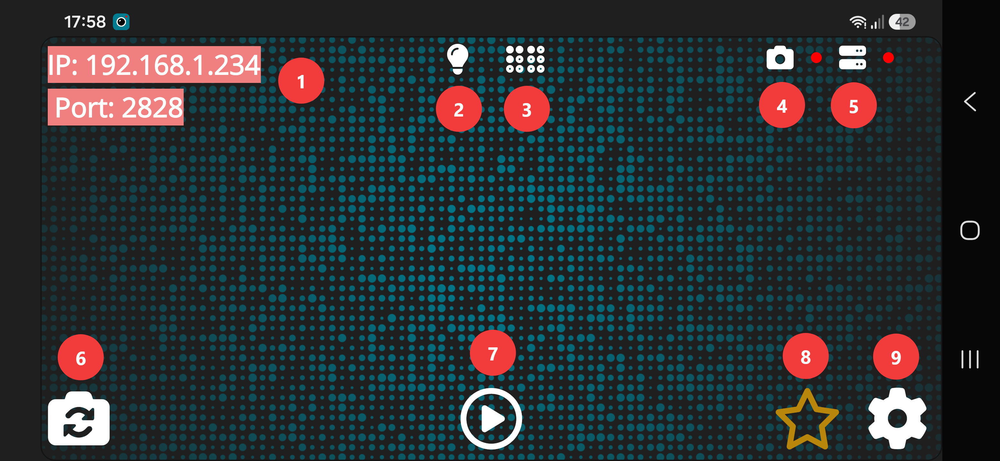
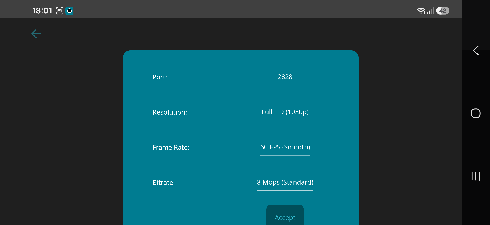

# DotCam Guide

This guide provides a detailed overview of the Android app, including its settings, streaming options, and connection-related information. It is intended to help you configure the app properly before connecting it to **DotCamClient** on Windows.

---

## About the Android App

DotCam is a .NET MAUI-based Android app designed to turn an Android device into a webcam source for a Windows PC.

Its development was driven by the goal of understanding and solving the technical challenges involved in camera handling, video streaming, and local device communication. Once the core technical questions had been clarified, the result was a standalone app built specifically for this purpose.

---

## Table of Contents

- [Main Screen Overview](#main-screen-overview)
- [Settings](#settings)
- [Foreground Service](#foreground-service)
- [App Start Failed Message](#app-start-failed-message)
- [If Nothing Else Helps](#if-nothing-else-helps)

---

## Main Screen Overview
<div align="center">

###  DotCam App  
 

</div>

---

The following overview explains the main controls and status indicators of the DotCam Android app.

### 1. IP Address and Port
The top-left area displays the current:

- **IP address**
- **Port**

These values are shown one below the other and are required to connect the Android app to **DotCamClient** on Windows.

### 2. Light
The light icon provides quick access to the app's light-related function.

Use this option when additional lighting support is needed, depending on the device and environment.

### 3. Noise Reduction
This icon provides access to image-related enhancement options such as noise reduction.

Use it to improve the image depending on lighting conditions and camera quality.

### 4. Camera Status Indicator
This icon shows the current camera status.

Indicator behavior:
- **Red** = camera is off
- **Green pulsing** = camera is active

### 5. Server Status Indicator
This icon shows the current server status.

Indicator behavior:
- **Red** = server is off
- **Green pulsing** = server is active

This helps confirm whether the app is ready to accept a connection from **DotCamClient**.

### 6. Switch Camera
The bottom-left camera icon switches between available cameras on the Android device.

This action can be performed at any time.

### 7. Start Camera / Preview
The play button in the bottom center controls the local camera preview inside the Android app.

It is used to start or stop the preview and does not directly represent the full streaming state on its own.

Important behavior:
- If only the **camera indicator** is green, the app is in **preview-only mode**
- In this state, the camera is active locally, but no active client stream is running
- If both the **camera indicator** and the **server indicator** are green and pulsing, streaming is active
- Even in this state, the preview can be turned off separately
- Therefore, both indicators may remain green and pulsing even if the preview is no longer visible in the app

### 8. Pro Version Indicator
The star icon shows the current license or version status of the app.

- **White star** = free version  
  Tap the icon to open the in-app page for upgrading to the **Pro version**

- **Yellow star** = Pro version unlocked  
  The purchase page is no longer available, and the icon remains visible as a status indicator only

### 9. Settings
The settings icon opens the app settings.

Use this section to configure:
- port
- resolution
- FPS
- bitrate
- additional camera-related options

## Settings
<div align="center">
  
 

</div>

The **Settings** section in the DotCam Android app allows you to adjust the streaming configuration before connecting to the Windows client.

### Port
Defines the network port used by the Android app for the video stream.

- The same port must be entered in **DotCamClient** on Windows
- Only change this value if needed for your network setup
- Make sure the selected port is not blocked by firewall or router settings

```text
😈════════════════════════════════════════════😈
⚠️           IMPORTANT WARNING                ⚠️
😈════════════════════════════════════════════😈
⚠️  Before changing driver settings,          ⚠️
⚠️  filter settings, or camera options        ⚠️
⚠️  in the Android app such as resolution,    ⚠️
⚠️  make sure that no application on Windows  ⚠️
⚠️  is currently using the camera.            ⚠️
⚠️  Otherwise, the camera may remain blocked  ⚠️
⚠️  by another application, and the requested ⚠️
⚠️  changes may not be possible.              ⚠️
😈════════════════════════════════════════════😈
```

### Resolution
Determines the video resolution used for streaming.

Available options:
- **HD**
- **Full HD**

Notes:
- **HD** usually provides better stability and lower bandwidth usage
- **Full HD** offers higher image quality but requires more resources

### FPS
Defines the streaming frame rate.

Available options:
- **60 FPS**
- **30 FPS**
- **25 FPS**
- **15 FPS**

Notes:
- **60 FPS** provides the smoothest motion
- Higher FPS values require more processing power and network bandwidth
- **30 FPS** is often a good balance between smoothness and performance
- **25 FPS** and **15 FPS** may help on slower devices or weaker networks

### Bitrate
Controls the video stream quality and bandwidth usage.

Available options:
- **2 Mbps**
- **4 Mbps**
- **6 Mbps**
- **8 Mbps**
- **12 Mbps**
- **16 Mbps**
- **20 Mbps**

Notes:
- Lower bitrate reduces bandwidth usage but may lower image quality
- Higher bitrate improves image quality but requires a more stable and faster network
- If you notice lag or instability, try reducing the bitrate

### High FPS for Front Camera
Enables higher frame rate modes for the front camera, if supported by the device.

Notes:
- This option may work differently depending on the Android device
- Higher frame rates are not guaranteed on all front cameras
- Actual performance depends on device hardware, camera support, and system limitations

---

## Foreground Service

DotCam uses a foreground service to keep the app running more reliably, especially when the Android screen is turned off.

This helps maintain the streaming process and reduces the chance of the app being paused or stopped by the Android system.

The notification text shown by the foreground service changes depending on the current camera status.

### Notification Actions

While the foreground service is active, Android displays a persistent notification with the following actions:

#### Delete
Removes the notification and closes the DotCam app completely.

As a result:
- the app is closed
- the stream is stopped
- the camera is closed
- the connection to **DotCamClient** is terminated

#### Stop Stream
Stops the active stream without fully closing the app.

As a result:
- the connection to **DotCamClient** is interrupted
- the app remains open
- the camera is closed
- the stream can be started again at any time
- the client can reconnect afterwards

### Important Note

The notification can also be removed manually through the Android system interface.

If this happens:
- it is no longer guaranteed that the app will remain active in the background
- the app may stop running depending on the device and Android system behavior
- in this case, the app should be started again manually

## App Start Failed Message

The DotCam Android app may display an **app start failed** message if required startup conditions are not fulfilled.

### Possible Causes

This usually happens for one of the following reasons:

- there is no active network connection
- no usable camera is available on the device
- not all required permissions have been granted

### Behavior

If this state occurs:
- the app UI remains inactive
- no controls can be used
- the app cannot be operated normally

After resolving the issue, the app must be restarted manually.

## If Nothing Else Helps

If none of the troubleshooting steps solve the issue, and there is still enough patience left after the frustration 😅, 
the log file can be shared directly from the **Settings** section of the app.

You can reach support at:

**email** **contact@simple-dots.de**

**WhatsApp** **+4915147728591**

Including a short description of the problem and what has already been tried can help speed up troubleshooting.