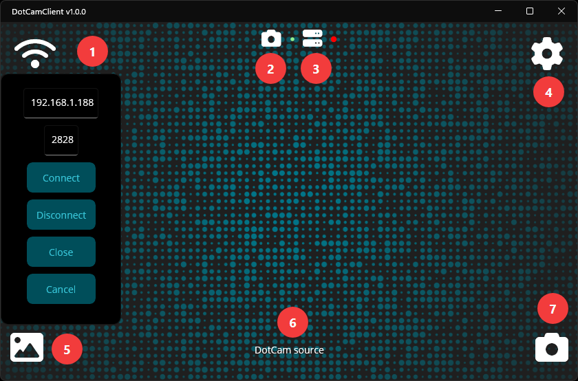
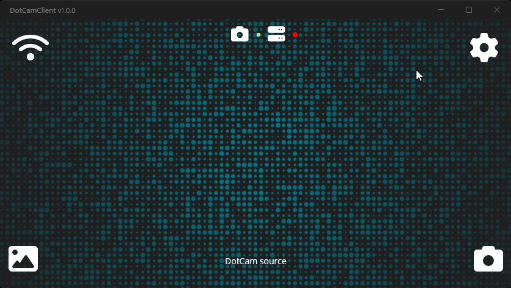
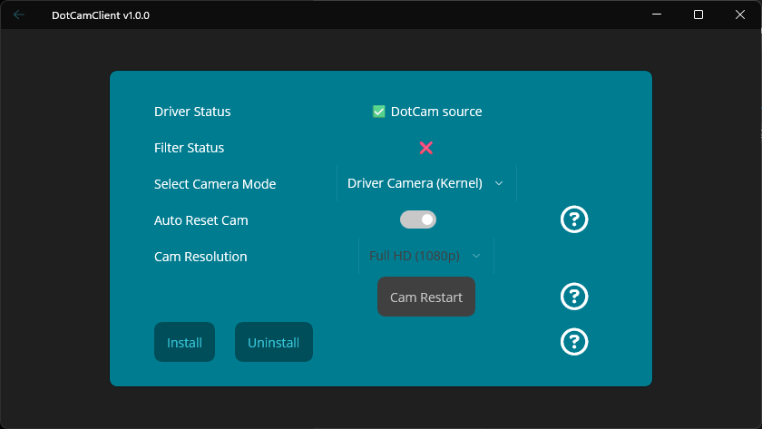

# DotCamClient Guide

DotCamClient is the Windows application used to connect to the DotCam Android app and receive the video stream on your PC.

This guide provides an overview of the client interface, connection setup, available options, and important behavior related to camera output on Windows. It is intended to help with configuring and using DotCamClient together with the Android app.

---

## About the Windows App

DotCamClient is primarily a .NET MAUI-based Windows application, but it is not built exclusively on MAUI alone. It also uses **FFmpeg** and native **C++ interfaces** to handle video processing and Windows camera integration.

The application is designed to receive the stream from the DotCam Android app and make it available on Windows in different ways, depending on the selected camera mode.

Detailed information about the available camera output types is provided in a separate section below.

---

## Table of Contents

- [Main Screen Overview](#main-screen-overview)
- [Settings](#settings)
- [Camera Selection](#camera-selection)
- [Camera Output Modes](#camera-output-modes)
- [If Nothing Else Helps](#if-nothing-else-helps)

---

## Main Screen Overview
<div align="center">

###  DotCamClient App  
 

</div>

The following overview explains the main controls and status indicators of the DotCamClient window.

### 1. Network Menu
The Wi-Fi icon in the top-left corner opens a small connection menu directly on the main screen.

This menu provides the following actions:
- **IP**
- **Port**
- **Connect**
- **Disconnect**
- **Close**
- **Cancel**

Use this menu to enter the connection details for the Android app and to control the client connection.

### 2. Camera Status Indicator
The camera icon in the top-center area shows whether the selected camera output mode is ready.

This applies to both:
- the **virtual camera driver**
- the **DirectShow filter**

Indicator behavior:
- **Red** = not ready or inactive
- **Green pulsing** = ready or active

### 3. Server Status Indicator
The server icon indicates the current connection or streaming state, similar to the Android app.

Indicator behavior:
- **Red** = inactive or disconnected
- **Green pulsing** = active or connected

### 4. Settings Menu
The settings icon in the top-right corner opens a separate page with the main menu.

This page provides access to:
- **camera settings**
- **help**
- a link to the **GitHub repository**
- **credits** for used NuGet packages

### 5. Preview / Idle Image
The image icon in the bottom-left corner is used to load a preview or idle image.

Notes:
- this usually happens automatically
- in some situations, it may need to be triggered manually
- for example, the driver may not render correctly while inactive unless an image is loaded

### 6. Current Camera Mode
The bottom-center area displays the name of the currently selected camera mode.

Displayed names:
- **DotCam source** = virtual camera driver
- **DotCam** = DirectShow filter

This helps identify which camera output mode is currently active.

### 7. Camera Output Settings
The camera icon in the bottom-right corner opens the settings for the available camera output modes.

Use this section to configure:
- the **virtual camera driver**
- the **DirectShow filter**

This section is intended for **advanced configuration** and is optional.  
In most cases, the default settings should work without requiring any changes.

---
## Settings

<div align="center">

###  Camera Settings  
 

</div>

The camera settings can be opened from the main menu by selecting the **settings icon** and then navigating to **Camera Settings**.

This section provides access to the most important image-related adjustments.

### Available Image Settings

The following values can be adjusted in this order:

- **Brightness**
- **Contrast**
- **Saturation**
- **Hue**
- **Gamma**

These image controls are implemented using **FFmpeg filters** and can be used to fine-tune the appearance of the camera output depending on lighting conditions and personal preference.

The color settings can also be changed while a connection is active.

Important behavior:
- after changing the values, click **Accept** to apply the new settings
- if you do not want to reset each value manually, use **Reset** to restore the default color settings

### Preview / Idle Image

Further down in the same section, the preview or idle image can also be changed.

This image may be used when no active camera image is currently being rendered, depending on the selected camera mode and current state.

---

## Camera Selection

<div align="center">

 

</div>

This section can be opened from the main screen through the **camera icon** in the bottom-right corner.

It provides access to the available camera output modes and related controls.

> **NOTE**
> This section is intended for **advanced configuration** and is optional.  
> In most cases, the default settings should work without requiring any changes.

### DriverStatus and FilterStatus
The first two lines show the current status of the available camera output components:

- **DriverStatus**
- **FilterStatus**

These values indicate whether the corresponding component is currently installed and available.

### Select Camera Mode
The **Select Camera Mode** dropdown is used to choose the active camera output mode.

Available modes may include:
- the **virtual camera driver**
- the **DirectShow filter**

### Auto Reset Cam
The **Auto Reset Cam** option is very important and should be treated with care.

This setting is enabled by default and is somewhat experimental.

If enabled:
- the camera can be reset automatically while a connection is active
- this is mainly used when camera parameters such as resolution need to be changed during use

```text
😈════════════════════════════════════════════😈
⚠️           IMPORTANT WARNING                ⚠️
😈════════════════════════════════════════════😈
⚠️  Before changing driver settings,          ⚠️
⚠️  filter settings, or camera options        ⚠️
⚠️  in the Android app such as resolution,    ⚠️
⚠️  make sure that no application on Windows  ⚠️
⚠️  is currently using the camera.            ⚠️
⚠️  Otherwise, the camera may remain blocked  ⚠️
⚠️  by another application, and the requested ⚠️
⚠️  changes may not be possible.              ⚠️
😈════════════════════════════════════════════😈
```

### Cam Resolution
If **Auto Reset Cam** is disabled, the camera resolution can be changed manually through the **Cam Resolution** dropdown.

This allows manual control over the resolution used by the selected camera mode.

Important note:
- if **Auto Reset Cam** is turned off and the camera is managed manually, the selected resolution must match the resolution configured in the Android app
- if the resolutions do not match, the Android device will reject the connection
- the connection can only be established when both sides use the same resolution

### Cam Restart
The **Cam Restart** button restarts the selected camera mode manually.

This can be useful for recovery if:
- the camera was previously blocked by another application
- the camera mode no longer updates correctly
- a reset is needed without restarting the full app or the PC

This recovery option works for both camera modes.

### Install / Uninstall
At the bottom of the section, the following buttons are available:

- **Install**
- **Uninstall**

These buttons are used to install or remove the selected camera component.

Additional note:
- the **DirectShow filter** may need to be registered again after certain Windows updates

---

## Camera Output Modes

DotCamClient provides two different camera output modes on Windows. Both support up to **Full HD** and **60 FPS**, but they differ in compatibility and usage behavior.

### 1. Virtual Camera Driver
This mode uses a real virtual camera device based on a Windows driver.

Main characteristics:
- behaves like a real virtual webcam device
- offers the best overall compatibility with Windows applications
- supports up to **Full HD** and **60 FPS**
- can only be used by **one application at a time**

Additional notes:
- the driver component is very small and is less than **60 KB**
- the implementation mainly uses the **user-mode** part from this repository:  
  [robot9706/VirtualCameraDriver](https://github.com/robot9706/VirtualCameraDriver)
- it also includes a custom variant based on the Microsoft sample:  
  [microsoft/Windows-driver-samples – avstream/avshws](https://github.com/microsoft/Windows-driver-samples/tree/main/avstream/avshws)

### 2. DirectShow Filter
This mode uses a **DirectShow filter** instead of a full virtual camera driver.

Main characteristics:
- supports up to **Full HD** and **60 FPS**
- can be used by **multiple applications at the same time**
- may not be supported by every Windows application

Additional notes:
- the filter component is very small and is less than **100 KB**
- this mode is based on:  
  [tshino/softcam](https://github.com/tshino/softcam)
- only minimal changes were made, mainly related to naming

---


## If Nothing Else Helps

If none of the troubleshooting steps solve the issue, and there is still enough patience left after the frustration 😅, 
the log file can be found here.

- Windows path:
- `C:\Users\YourName\AppData\Local\User Name\com.simpledots.dotcamclient\Data`

You can reach support at:

**email** **contact@simple-dots.de**

**WhatsApp** **+4915147728591**

Including a short description of the problem and what has already been tried can help speed up troubleshooting.